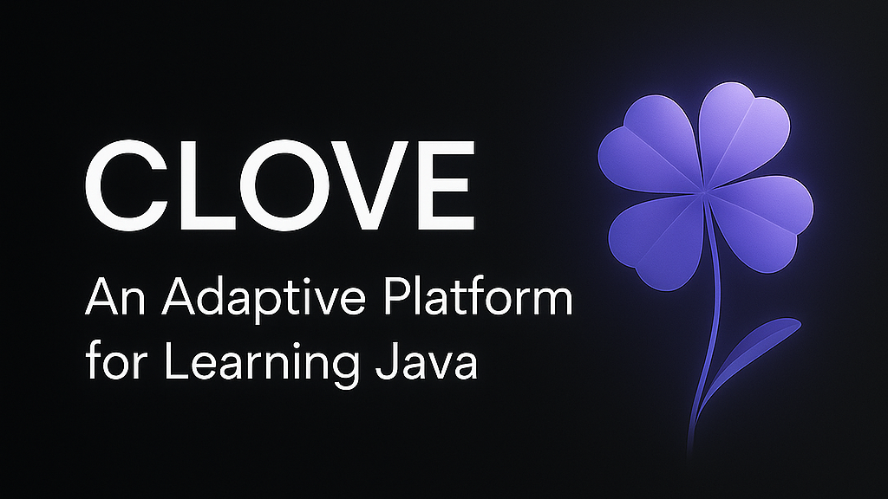

## 📘 Table of Contents
- [About CLOVE](#-system-overview)
- [Purpose](#purpose)
- [Core Algorithms](#-core-algorithms)
  - [Bayesian Knowledge Tracing (BKT)](#1-bayesian-knowledge-tracing-bkt)
  - [Q-Learning (Reinforcement Learning)](#2-q-learning-reinforcement-learning)
  - [Adaptive Challenge Selection](#3-adaptive-challenge-selection)
  - [Learning Engine](#4-learning-engine)
  - [Algorithm Utilities](#5-algorithm-utilities)
- [System Architecture](#-system-architecture)
  - [Frontend (React + Vite)](#frontend-react--vite)
  - [Backend (FastAPI + PostgreSQL)](#backend-fastapi--postgresql)
  - [Database Schema](#database-schema)
- [Learning Features](#-learning-features)
  - [Challenge Types](#challenge-types)
  - [Thematic Environments](#thematic-environments)
  - [Adaptive Features](#adaptive-features)
- [Getting Started](#-getting-started)
  - [Prerequisites](#prerequisites)
  - [Frontend Setup](#frontend-setup)
  - [Backend Setup](#backend-setup)
  - [Database Access](#database-access)
- [Usage](#-usage)
- [Development](#-development)
  - [Project Structure](#project-structure)
  - [Key Technologies](#key-technologies)
- [Learning Metrics & Insights](#-learning-metrics--insights)
- [Security](#-security)
- [Deployment](#-deployment)
  - [Production URLs](#production-urls)
  - [Deployment Architecture](#deployment-architecture)
- [License](#-license)


## 🎯 System Overview

**CLOVE** (Code, Logic, Overcome, Validate, Excel) is an intelligent, adaptive learning platform designed to teach Java programming through immersive, game-inspired challenges. The system combines advanced educational algorithms with engaging thematic environments to create a personalized learning experience that adapts to each student's performance and learning patterns.

### Purpose

CLOVE addresses the challenge of making programming education more engaging and effective by:

- **Personalizing Learning**: Adapts challenge difficulty, timing, and hints based on individual performance
- **Gamifying Education**: Uses immersive themes (Wizard Academy, Space Mission, Noir Detective) to make learning engaging
- **Optimizing Learning Paths**: Employs AI algorithms to select the most effective challenges for each student
- **Tracking Progress**: Provides detailed analytics and progress visualization
- **Ensuring Mastery**: Uses assessment systems to verify knowledge retention

## 🧠 Core Algorithms

### 1. Bayesian Knowledge Tracing (BKT)
- **Purpose**: Models student knowledge state and predicts learning outcomes
- **File Location**: `clove-backend/app/core/bkt.py`
- **Parameters**:
  - `p_T = 0.1` (Transition probability - likelihood of learning)
  - `p_G = 0.2` (Guess probability - chance of correct answer without knowledge)
  - `p_S = 0.1` (Slip probability - chance of incorrect answer despite knowledge)
- **Implementation**: Updates knowledge probability after each challenge attempt
- **Key Method**: `update_knowledge(knowledge_prob, is_correct)`

### 2. Q-Learning (Reinforcement Learning)
- **Purpose**: Optimizes challenge selection strategy based on student performance
- **File Location**: `clove-backend/app/core/rl.py`
- **Parameters**:
  - `α = 0.1` (Learning rate)
  - `γ = 0.9` (Discount factor)
  - `ε = 0.8` (Initial exploration rate, decays to 0.1)
- **State Space**: (Mastery Level, Timer Active, Hint Active)
- **Actions**: Challenge types (code_fixer, code_completion, output_tracing)
- **Rewards**: Based on correctness, hints used, timing, and streak performance
- **Key Methods**: `select_action(state)`, `update_q_value(current_state, action, reward, next_state)`

### 3. Adaptive Challenge Selection
- **Purpose**: Intelligently selects the most appropriate challenge for each student
- **File Location**: `clove-backend/app/services/selection.py`
- **Mastery Classification**: 
  - Beginner (0-33% knowledge)
  - Intermediate (34-66% knowledge) 
  - Advanced (67-100% knowledge)
- **Difficulty Mapping**: Automatically adjusts challenge difficulty based on mastery level
- **Streak Analysis**: Tracks correct/incorrect streaks to activate timers and hints
- **Key Functions**: `_select_adaptive_challenge()`, `_select_non_adaptive_challenge()`

### 4. Learning Engine
- **Purpose**: Orchestrates the learning process and updates student knowledge
- **File Location**: `clove-backend/app/services/engine.py`
- **Functions**: 
  - Manages adaptive and non-adaptive learning updates
  - Integrates BKT and Q-Learning algorithms
  - Handles reward calculation and state transitions
- **Key Functions**: `_run_adaptive_update()`, `_run_non_adaptive_update()`

### 5. Algorithm Utilities
- **Purpose**: Common utilities and configuration for all algorithms
- **File Location**: `clove-backend/app/core/utils.py`
- **Contains**:
  - Algorithm parameters and constants
  - Mastery classification functions
  - Q-table value rounding utilities
  - Challenge type and difficulty mappings

## 🏗️ System Architecture

### Frontend (React + Vite)
- **Framework**: React 19 with Vite for fast development
- **Styling**: SCSS with Bootstrap 5 and custom theme system
- **State Management**: React Context API for authentication and app state
- **Routing**: React Router DOM for navigation
- **UI Components**: Custom components with Framer Motion animations
- **Code Editor**: Monaco Editor for syntax highlighting and code completion
- **Charts**: Recharts for progress visualization

### Backend (FastAPI + PostgreSQL)
- **Framework**: FastAPI with async/await support
- **Database**: PostgreSQL with SQLAlchemy ORM
- **Authentication**: JWT tokens with refresh token mechanism
- **API Design**: RESTful API with automatic OpenAPI documentation
- **Email Service**: Brevo integration for user notifications
- **Deployment**: Render.com with PostgreSQL database

### Database Schema
Core entities include:
- **Users**: Student profiles and authentication
- **Topics/Subtopics**: Learning content hierarchy
- **Challenges**: Interactive coding exercises with multiple types
- **Lessons**: Educational content and tutorials
- **Assessments**: Pre/post assessments for knowledge evaluation
- **Q-Values**: Reinforcement learning state-action values
- **Statistics**: Performance tracking and analytics

## 🎮 Learning Features

### Challenge Types
1. **Code Fixer**: Identify and correct bugs in provided code
2. **Code Completion**: Complete missing code segments
3. **Output Tracing**: Predict program output and trace execution

### Thematic Environments
- **Wizard Academy**: Fantasy-themed learning with magical elements
- **Noir Detective**: Mystery-themed problem-solving scenarios
- **Space Mission**: Sci-fi themed challenges aboard a starship

### Adaptive Features
- **Dynamic Difficulty**: Automatically adjusts based on performance
- **Smart Hints**: Contextual help that activates during struggle
- **Timer Management**: Adaptive time limits based on performance streaks
- **Progress Tracking**: Real-time analytics and mastery visualization

## 🚀 Getting Started

Before running **CLOVE**, both the frontend and backend need to be set up to ensure the system runs correctly.  

Make sure the following prerequisites are already installed and properly configured on your machine before proceeding:
### Prerequisites
- Node.js 18+ and npm
- Python 3.11+
- PostgreSQL database
- Git

Start by cloning the project repository, then follow the setup steps in order — beginning with the **frontend**, followed by the **backend**.  

### Frontend Setup

1. **Navigate to frontend directory**:
```bash
cd clove-frontend
# Moves into the frontend project folder
```

2. **Install dependencies**:
```bash
npm install
# Installs all required frontend packages
```

3. **Start development server**:
```bash
npm run dev
# Launches the frontend on the local development server
```

### Backend Setup

1. **Navigate to backend directory**:
```bash
cd clove-backend
# Moves into the backend project folder
```

2. **Create virtual environment**:
```bash
python -m venv venv
source venv/bin/activate  # On Windows: venv\Scripts\activate
# Creates and activates an isolated Python environment
```

3. **Install dependencies**:
```bash
pip install -r requirements.txt
# Installs all required backend packages
```

4. **Set up environment variables**:
```bash
cp .env.template .env
# Edit .env with your database and API keys
```

5. **Generate JWT Secret Key**:
```bash
python -m scripts.generate_key (creation of key)
# Edit .env and add the generated key under JWT Secret Key
```

   5.1 **Populate the database by seeding**:
   ```bash
   python -m app.db.seeder
   # Run this only if the database has not been seeded yet
   ```

6. **Run database migrations**:
```bash
alembic upgrade head
# Applies all database schema migrations
```

7. **Start the server**:
```bash
uvicorn app.main:app --reload
# Starts the FastAPI backend server in development mode
```

### Database Access

To access the Render PostgreSQL database:

1. **Via Render Dashboard**:
   - Go to your Render dashboard
   - Navigate to your PostgreSQL service
   - Use the built-in database browser or connection details

2. **Via psql (if you have connection details)**:
```bash
psql -h YOUR_RENDER_DB_HOST -U YOUR_USERNAME -d YOUR_DB_NAME
```

3. **Via Database URL**:
   - Use the DATABASE_URL from your Render environment variables
   - Connect using your preferred PostgreSQL client

## 📊 Usage

### How to Use CLOVE
Follow these steps to navigate the platform and begin your learning journey:

1. **Access the Website** – Open the CLOVE platform in your browser.  
2. **Sign Up or Log In** – Create an account or sign in to enter your learning dashboard.  
3. **Open “My Deck”** – Go to the **My Deck** tab to browse and start available lessons.  
4. **Start a Lesson** – Take the pre-assessment to unlock subtopics under the selected lesson.  
5. **Study Each Subtopic** – Read the learning materials provided for every subtopic.  
6. **Practice and Challenge** – Apply your knowledge through practice exercises or coding challenges.  
7. **Track Progress** – Visit the **Progress** tab to monitor your overall improvement and completion across lessons.


## 🔧 Development

### Project Structure
```
CLOVE-Restructured/
├── clove-frontend/          # React frontend application
│   ├── src/
│   │   ├── features/        # Feature-based modules
│   │   ├── components/      # Reusable UI components
│   │   ├── contexts/        # React context providers
│   │   └── styles/          # SCSS styling system
├── clove-backend/           # FastAPI backend application
│   ├── app/
│   │   ├── api/            # API endpoints
│   │   ├── core/           # Core algorithms (BKT, RL)
│   │   ├── crud/           # Database operations
│   │   ├── db/             # Database models and session
│   │   ├── schemas/        # Pydantic schemas
│   │   └── services/       # Business logic services
└── scripts/                # Utility scripts
```

### Key Technologies
- **Frontend**: React, Vite, SCSS, Bootstrap, Framer Motion
- **Backend**: FastAPI, SQLAlchemy, PostgreSQL, Alembic
- **AI/ML**: NumPy, Custom BKT and Q-Learning implementations
- **Deployment**: Netlify (Frontend), Render.com (Backend + Database)
- **Development**: Black, isort, ESLint

## 📊 Learning Metrics & Insights

The platform tracks detailed learning data to evaluate student progress and adapt challenges dynamically, including:
- Mastery progression
- Challenge completion rates
- Time-to-mastery
- Learning efficiency
- Adaptive model performance

## 🔒 Security

Multiple layers of security are implemented to protect user data and maintain application integrity, including:

- **JWT-based authentication** with refresh tokens for secure session management  
- **Password hashing** using bcrypt  
- **CORS protection** and **rate limiting** to prevent unauthorized or excessive requests  
- **Input validation** and **sanitization** to reduce injection risks  
- **Secure database connections** using encrypted credentials

## 🌐 Deployment

The platform is deployed using cloud-based services for scalability and reliability.

- **Frontend**: Deployed on [Netlify](https://netlify.com)
- **Backend API**: Deployed on [Render.com](https://render.com)
- **Database**: PostgreSQL hosted on Render.com


### Deployment Architecture
```
┌─────────────────┐    ┌─────────────────┐    ┌─────────────────┐
│   Netlify       │    │   Render.com    │    │   Render.com    │
│   (Frontend)    │◄──►│   (Backend)     │◄──►│   (Database)    │
│   React App     │    │   FastAPI       │    │   PostgreSQL    │
└─────────────────┘    └─────────────────┘    └─────────────────┘
```


## 📝 License
This project is licensed under the MIT License.  
See the [LICENSE](./LICENSE) file for details.


